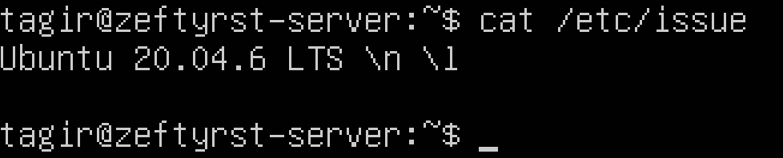
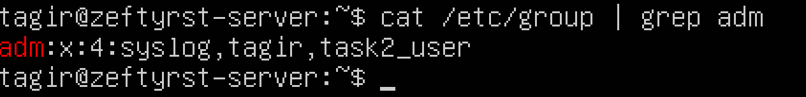

# UNIX/Linux operating systems (Basic).

Linux system installation and updates. Administration basics.

## Contents

1. [Installation of the OS](#part-1-installation-of-the-os)  
2. [Creating a user](#part-2-creating-a-user)  
3. [Setting up the OS network](#part-3-setting-up-the-os-network)   
4. [OS Update](#part-4-os-update)  
5. [Using the sudo command](#part-5-using-the-sudo-command)  
6. [Installing and configuring the time service](#part-6-installing-and-configuring-the-time-service)  
7. [Installing and using text editors](#part-7-installing-and-using-text-editors)  
8. [Installing and basic setup of SSHD service](#part-8-installing-and-basic-setup-of-the-sshd-service)  
9. [Installing and using the top, htop utilities](#part-9-installing-and-using-the-top-htop-utilities)   
10. [Using the fdisk utility](#part-10-using-the-fdisk-utility)   
11. [Using the df utility](#part-11-using-the-df-utility)    
12. [Using the du utility](#part-12-using-the-du-utility)    
13. [Installing and using the ncdu utility](#part-13-installing-and-using-the-ncdu-utility)    
14. [Working with system logs](#part-14-working-with-system-logs)     
15. [Using the CRON job scheduler](#part-15-using-the-cron-job-scheduler)

## Part 1. Installation of the OS

1.1. Ubuntu version checking

    cat /etc/issue

  

## Part 2. Creating a user

**== Task ==**

##### Create a user other than the one created during installation. The user must be added to `adm` group.
- Add a screenshot of command call to create user.
- The new user must be in the output of the command: \
  `cat /etc/passwd`
- Add a screenshot of the command output.

**== Result ==**

2.1. Command to create user

    $ sudo adduser <new_user_name>

  

2.2. Command to add new user to `adm` group

    $ sudo usermod -G adm <user_name>

  

2.3. New user creation checking 
      
    $ cat /etc/passwd | grep task2_user

  

2.4. Group checking

    $ cat /etc/group | grep adm

  

  > sudo - Substitute User and do

## Part 3. Setting up the OS network

**== Task ==**

##### Set the machine name as user-1
##### Set the time zone corresponding to your current location.

##### Output the names of the network interfaces using a console command.
- In the report give an explanation for the presence of the lo interface.
##### Use the console command to get the ip address of the device you are working on from the DHCP server.
- Decode DHCP in the report.
##### Define and display the external ip address of the gateway (ip) and the internal IP address of the gateway, aka default ip address (gw).
##### Set static (manually set, not received from DHCP server) ip, gw, dns settings (use public DNS servers, e.g. 1.1.1.1 or 8.8.8.8).

##### Reboot the virtual machine. Make sure that the static network settings (ip, gw, dns) correspond to those set in the previous point.
- Describe in the report what you have done to complete all seven points (you can do it in text or with screenshots).
- Successfully ping 1.1.1.1 and ya.ru remote hosts and add a screenshot of the output command to the report. There should be "0% packet loss" phrase in command output.

**== Result ==**

3.1. Setting the machine name as user-1

    $ hostnamectl set-hostname user-1

  

  After machine reboot
  
    $ sudo reboot

  

3.2. Setting the time zone corresponding to current location

    $ timedatectl
    $ timdatectl list-timezones | grep Moscow
    $ sudo timedatectl set-timezone Europe/Moscow
    $ timedatectl

  

  Another way with tzselect utility:
      
    $ tzselect

  

3.3. The names of the network interfaces output using a console command

    $ ip -br address

  

  > [Virtual loopback interface](https://en.wikipedia.org/wiki/Loopback)
  > 
  > Implementations of the Internet protocol suite include a virtual network interface through which network applications can communicate when executing on the same machine. It is implemented entirely within the operating system's networking software and passes no packets to any network interface controller. Any traffic that a computer program sends to a loopback IP address is simply and immediately passed back up the network software stack as if it had been received from another device. Unix-like systems usually name this loopback interface **lo** or **lo0**.
  >
  > [lo (loopback device)](https://ru.hexlet.io/courses/linux-administration/lessons/interfaces/theory_unit) – виртуальный интерфейс, присутствующий по умолчанию в любом Linux. Он используется для отладки сетевых программ и запуска серверных приложений на локальной машине. С этим интерфейсом всегда связан адрес 127.0.0.1. У него есть dns-имя – *localhost*. Посмотреть привязку можно в файле `/etc/hosts`.

3.4. Getting the ip address of the device from the DHCP server

    $ hostname -I

  

  > [Dynamic Host Configuration Protocol (DHCP)](https://learn.microsoft.com/en-us/windows-server/networking/technologies/dhcp/dhcp-top) is a client/server protocol that automatically provides an Internet Protocol (IP) host with its IP address and other related configuration information such as the subnet mask and default gateway.
  >
  > [DHCP](https://ru.wikipedia.org/wiki/DHCP) (англ. Dynamic Host Configuration Protocol — протокол динамической настройки узла) — сетевой протокол, позволяющий сетевым устройствам автоматически получать IP-адрес и другие параметры, необходимые для работы в сети TCP/IP. Данный протокол работает по модели «клиент-сервер».

3.5. Defining and displaying the external ip address of the gateway (ip) and the internal IP address of the gateway, aka default ip address (gw)

* Some ways to find out external ip address of the gatewey

      $ wget -qO - icanhazip.com
      $ curl icanhazip.com
      $ curl ifconfig.me

  

  > icanhazip.com - the site that returns an ip as a string.

* Defining internal ip address of the gatewey

      $ ip route | grep default
    
  

3.6. Setting static (manually set, not received from DHCP server) ip, gw, dns settings (use public DNS servers, e.g. 1.1.1.1 or 8.8.8.8).

* Changing ip, gw, dns settings in `/etc/netplan/00-installer-config.yaml`

      $ sudo vim /etc/netplan/00-installer-config.yaml

  
  
  

* Changes checking and applying

      $ sudo netplan apply

  

3.7. Rebooting the virtual machine.
<!-- Making sure that the static network settings (ip, gw, dns) correspond to those set in the previous point. -->
<!-- - Describe in the report what you have done to complete all seven points (you can do it in text or with screenshots).
- Successfully ping 1.1.1.1 and ya.ru remote hosts and add a screenshot of the output command to the report. There should be "0% packet loss" phrase in command output. -->

* Rebooting

      $ reboot

* Ping checking

      $ ping 1.1.1.1

    

      $ ping ya.ru

    

## Part 4. OS Update

**== Task ==**

##### Update the system packages to the latest version
- After updating the system packages, if you enter the update command again, a message should appear saying there are no updates.
- Add a screenshot of this message to the report.

**== Result ==**

* Sync the package index files from their sources via Internet

      $ sudo apt update
  
  

* Installing the newest versions of all installed packages

      $ sudo apt upgrade

  

* Updates checking

      $ sudo apt update

  
