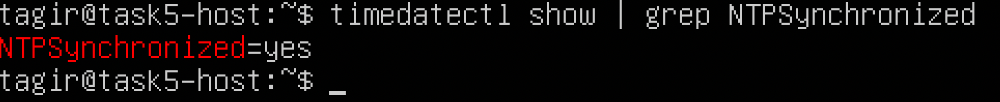
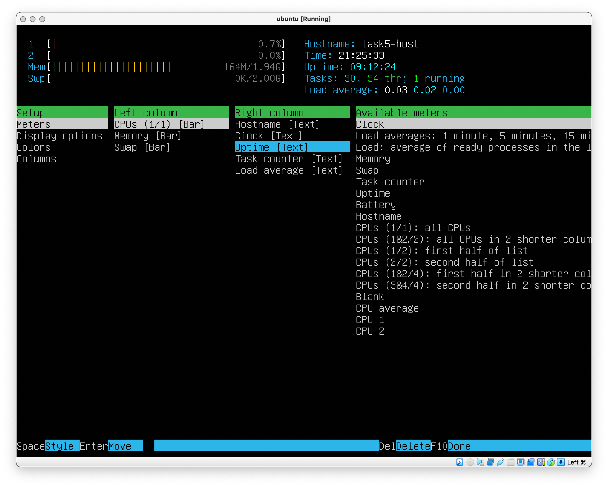
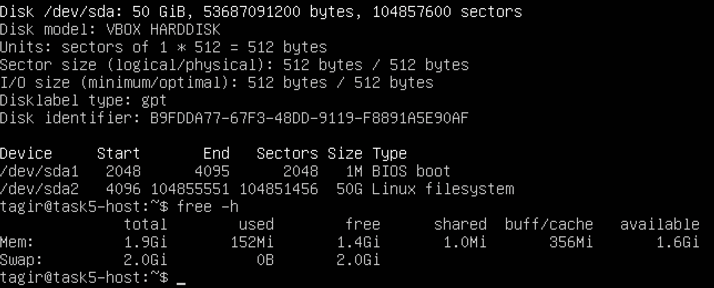

# UNIX/Linux operating systems (Basic).

Linux system installation and updates. Administration basics.

## Contents

1. [Installation of the OS](#part-1-installation-of-the-os)  
2. [Creating a user](#part-2-creating-a-user)  
3. [Setting up the OS network](#part-3-setting-up-the-os-network)   
4. [OS Update](#part-4-os-update)  
5. [Using the sudo command](#part-5-using-the-sudo-command)  
6. [Installing and configuring the time service](#part-6-installing-and-configuring-the-time-service)  
7. [Installing and using text editors](#part-7-installing-and-using-text-editors)  
8. [Installing and basic setup of SSHD service](#part-8-installing-and-basic-setup-of-the-sshd-service)  
9. [Installing and using the top, htop utilities](#part-9-installing-and-using-the-top-htop-utilities)   
10. [Using the fdisk utility](#part-10-using-the-fdisk-utility)   
11. [Using the df utility](#part-11-using-the-df-utility)    
12. [Using the du utility](#part-12-using-the-du-utility)    
13. [Installing and using the ncdu utility](#part-13-installing-and-using-the-ncdu-utility)    
14. [Working with system logs](#part-14-working-with-system-logs)     
15. [Using the CRON job scheduler](#part-15-using-the-cron-job-scheduler)

## Part 1. Installation of the OS

1.1. Ubuntu version checking

    cat /etc/issue

  

## Part 2. Creating a user

**== Task ==**

##### Create a user other than the one created during installation. The user must be added to `adm` group.
- Add a screenshot of command call to create user.
- The new user must be in the output of the command: \
  `cat /etc/passwd`
- Add a screenshot of the command output.

**== Solution ==**

2.1. Command to create user

    $ sudo adduser <new_user_name>

  

2.2. Command to add new user to `adm` group

    $ sudo usermod -G adm <user_name>

  

2.3. New user creation checking 
      
    $ cat /etc/passwd | grep task2_user

  

2.4. Group checking

    $ cat /etc/group | grep adm

  

## Part 3. Setting up the OS network

**== Task ==**

##### Set the machine name as user-1
##### Set the time zone corresponding to your current location.

##### Output the names of the network interfaces using a console command.
- In the report give an explanation for the presence of the lo interface.
##### Use the console command to get the ip address of the device you are working on from the DHCP server.
- Decode DHCP in the report.
##### Define and display the external ip address of the gateway (ip) and the internal IP address of the gateway, aka default ip address (gw).
##### Set static (manually set, not received from DHCP server) ip, gw, dns settings (use public DNS servers, e.g. 1.1.1.1 or 8.8.8.8).

##### Reboot the virtual machine. Make sure that the static network settings (ip, gw, dns) correspond to those set in the previous point.
- Describe in the report what you have done to complete all seven points (you can do it in text or with screenshots).
- Successfully ping 1.1.1.1 and ya.ru remote hosts and add a screenshot of the output command to the report. There should be "0% packet loss" phrase in command output.

**== Solution ==**

3.1. Setting the machine name as user-1

    $ hostnamectl set-hostname user-1

  

  After machine reboot
  
    $ sudo reboot

  

3.2. Setting the time zone corresponding to current location

    $ timedatectl
    $ timdatectl list-timezones | grep Moscow
    $ sudo timedatectl set-timezone Europe/Moscow
    $ timedatectl

  

  Another way with tzselect utility:
      
    $ tzselect

  

3.3. The names of the network interfaces output using a console command

    $ ip -br address

  

  > [Virtual loopback interface](https://en.wikipedia.org/wiki/Loopback)
  > 
  > Implementations of the Internet protocol suite include a virtual network interface through which network applications can communicate when executing on the same machine. It is implemented entirely within the operating system's networking software and passes no packets to any network interface controller. Any traffic that a computer program sends to a loopback IP address is simply and immediately passed back up the network software stack as if it had been received from another device. Unix-like systems usually name this loopback interface **lo** or **lo0**.
  >
  > [lo (loopback device)](https://ru.hexlet.io/courses/linux-administration/lessons/interfaces/theory_unit) – виртуальный интерфейс, присутствующий по умолчанию в любом Linux. Он используется для отладки сетевых программ и запуска серверных приложений на локальной машине. С этим интерфейсом всегда связан адрес 127.0.0.1. У него есть dns-имя – *localhost*. Посмотреть привязку можно в файле `/etc/hosts`.

3.4. Getting the ip address of the device from the DHCP server

    $ hostname -I

  

  > [Dynamic Host Configuration Protocol (DHCP)](https://learn.microsoft.com/en-us/windows-server/networking/technologies/dhcp/dhcp-top) is a client/server protocol that automatically provides an Internet Protocol (IP) host with its IP address and other related configuration information such as the subnet mask and default gateway.
  >
  > [DHCP](https://ru.wikipedia.org/wiki/DHCP) (англ. Dynamic Host Configuration Protocol — протокол динамической настройки узла) — сетевой протокол, позволяющий сетевым устройствам автоматически получать IP-адрес и другие параметры, необходимые для работы в сети TCP/IP. Данный протокол работает по модели «клиент-сервер».

3.5. Defining and displaying the external ip address of the gateway (ip) and the internal IP address of the gateway, aka default ip address (gw)

* Some ways to find out external ip address of the gatewey

      $ wget -qO - icanhazip.com
      $ curl icanhazip.com
      $ curl ifconfig.me

  

  > icanhazip.com - the site that returns an ip as a string.

* Defining internal ip address of the gatewey

      $ ip route | grep default
    
  

3.6. Setting static (manually set, not received from DHCP server) ip, gw, dns settings (use public DNS servers, e.g. 1.1.1.1 or 8.8.8.8).

* Changing ip, gw, dns settings in `/etc/netplan/00-installer-config.yaml`

      $ sudo vim /etc/netplan/00-installer-config.yaml

  

  before:

  

  after:

  

* Changes checking and applying

      $ sudo netplan apply

  

3.7. Rebooting the virtual machine.
<!-- Making sure that the static network settings (ip, gw, dns) correspond to those set in the previous point. -->
<!-- - Describe in the report what you have done to complete all seven points (you can do it in text or with screenshots).
- Successfully ping 1.1.1.1 and ya.ru remote hosts and add a screenshot of the output command to the report. There should be "0% packet loss" phrase in command output. -->

* Rebooting

      $ reboot

* Ping checking

      $ ping 1.1.1.1

    

      $ ping ya.ru

    

## Part 4. OS Update

**== Task ==**

##### Update the system packages to the latest version
- After updating the system packages, if you enter the update command again, a message should appear saying there are no updates.
- Add a screenshot of this message to the report.

**== Solution ==**

* Sync the package index files from their sources via Internet

      $ sudo apt update
  
  

* Installing the newest versions of all installed packages

      $ sudo apt upgrade

  

* Updates checking

      $ sudo apt update

  

## Part 5. Using the **sudo** command

**== Task ==**

##### Allow user created in [Part 2](#part-2-creating-a-user) to execute sudo command.
- In the report explain the *true* purpose of sudo command (don’t write about the fact that this word is "magic" one).
- Change the OS hostname via the user created in [Part 2](#part-2-creating-a-user) (using sudo).
- Add screenshot with changed hostname to the report.

**== Solution ==**

5.1. What is `sudo`? Sudoku maybe?

  > `sudo` - Substitute User and do - is a command-line utility for Unix and Unix-based operating systems such as Linux and macOS. The utility provides an efficient way to temporarily grant users or user groups privileged access to system resources so that they can run commands that they cannot run under their regular accounts. Users can even be granted permissions to run commands under the root account -- the most powerful account on Unix-like systems. `Sudo` also logs all commands and arguments so that administrators can track the behavior of `sudo` users.
  >
  > Назначение утилиты `sudo` — выполнение команды от имени другого пользователя, обычно от root. Смысл выполнения команды от root в том, что у него повышенные права доступа и, применяя `sudo`, обычный пользователь может выполнить те действия, на которые у него недостаточно прав.
  >
  > Она позволяет легко контролировать доступ к важным приложениям в системе. По умолчанию, при установке Ubuntu первому пользователю (тому, который создаётся во время установки) предоставляются полные права на использование sudo. Т.е. фактически первый пользователь обладает той же свободой действий, что и root.

5.2. Adding task2_user to sudo group

* Adding task2_user to sudo group

      $ sudo ussermod -aG sudo task2_user

  

* Checking task2_user is in sudo group

      $ cat /etc/group | grep sudo
  
  

5.3. Change the OS hostname via the task2_user

* Switching to task2_user

      $ su - task2_user

  

* Changing OS hostname by task2_user

      $ sudo hostname task5_host
      $ hostname
  
  

## Part 6. Installing and configuring the time service

**== Task ==**

##### Set up the automatic time synchronisation service.
- Output the time of the time zone in which you are currently located.
- The output of the following command must contain `NTPSynchronized=yes`: \
  `timedatectl show`
- Add screenshots of the correct time and command output to the report.

**== Solution ==**

6.1. Current time and timezone output

    $ timedatectl

  

6.2. 

    $ timedatectl show | grep NTPSynchronized

  

## Part 7. Installing and using text editors

**== Task ==**

##### Install **VIM** text editor (+ any two others if you like **NANO**, **MCEDIT**, **JOE** etc.)

##### Using each of the three selected editors, create a *test_X.txt* file, where X is the name of the editor in which the file is created. Write your nickname in it, close the file and save the changes.
- Add screenshots to the report:
    - Of each editor with the contents of the file before closing.
- Write down in the report what you have done to exit with the changes saved.

##### Using each of the three selected editors, open the file for editing, edit the file by replacing the nickname with the "21 School 21" string, close the file without saving the changes.
- Add screenshots to the report:
    - Of each editor with the contents of the file after editing.
- Write down in the report what you have done to exit without saving the changes.
##### Using each of the three selected editors, edit the file again (similar to the previous point) and then master the functions of searching through the contents of a file (a word) and replacing a word with any other one.
- Add screenshots to the report:
    - Of each editor with word search results.
    - Of each editor with commands entered to replace a word with another.

**== Solution ==**

7.1. Text editors installing

    $ sudo apt install vim
    $ sudo apt install nano
    $ sudo apt install mcedit

7.2. Text files creating and filling with some text

VIM

      $ vim test_vim.txt

  > press `i` to switch insert mode on

  

  > press `Esc` to switch insert mode off
  >
  > input `:wq` to close the file and save the changes

NANO

      $ nano test_nano.txt
    
  

  > press in sequence: `control+X` -> `y` -> `Enter` to close the file and save the changes

MCEDIT

      $ mcedit test_mcedit.txt
    
  

  > press `F2` -> `Enter` to save the changes
  >
  > press `F10` to close the file
  >
  > OR press `Esc` -> `y` to close the file and save the changes

  

7.3. Text files editing and closing without saving the cheanges

VIM

      $ vim test_vim.txt

  > press `i` to switch insert mode on

  

  > press `Esc` to switch insert mode off
  >
  > input `:q!` to close the file without saving the changes

NANO

      $ nano test_nano.txt
    
  

  > press in sequence: `control+X` -> `n` to close the file without saving the changes

MCEDIT

      $ mcedit test_mcedit.txt
    
  

  > press `F10` -> `n` to close the file without saving the changes
  >
  > OR press `Esc` -> `n` to close the file without saving the changes

7.4. Text searching and text replacing in the files

VIM

  

    :s/21 /21_

  

NANO

  > press `control+W` and input pattern to search

  

  > press `control+\` -> input pattern -> `Enter` -> input new text -> `Enter`
  >
  > press:
  >> `y` to replace current instance
  >>
  >> `n` to miss current instance
  >>
  >> `a` to replace all matches
  >>
  >> `control+C` to cancel the replace mode

  

MCEDIT

  > press `F7` to switch search mode on
  >
  > input pattern
  >
  > set searching mode
  >
  > press:
  >> `o` to find first match
  >>
  >> `f` to find all matches
  >>
  >> `c` or `Esc` to cancel the search mode

  

  > press `F4` to switch replace mode on
  >
  > input search string
  >
  > input replacement string
  >
  > select replacement settings
  >
  > press:
  >> `o` to replace first match
  >>
  >> `c` or `Esc` to cancel the replace mode

  

## Part 8. Installing and basic setup of the **SSHD** service

`-` It's convenient to have access from one computer to another over a network, isn't it? But to make it not only convenient, but also safe, you should use SSH service.

**== Task ==**

##### Install the SSHd service.
##### Add an auto-start of the service whenever the system boots.
##### Reset the SSHd service to port 2022.
##### Show the presence of the sshd process using the ps command. To do this, you need to match the keys to the command.
- Explain in the report the meaning of the command and each key in it.
##### Reboot the system.
- Describe in the report what you have done to complete all five points (you can do this in text or with screenshots).
- The output of the netstat -tan command should contain \
  `tcp 0 0.0.0.0:2022 0.0.0.0:* LISTEN` \
  (if there is no netstat command, it needs to be installed)
- Add a screenshot of the command output to the report.
- Explain the meaning of the -tan keys, the value of each output column, the value 0.0.0.0. in the report.

**== Solution ==**

8.1. The SSHd service installing

     $ sudo apt install openssh-server

  

8.2. An auto-start of the service adding

* Status ssh checking

      $ systemctl status ssh
  
  

* Enable ssh

      $ sudo systemctl enable ssh
  
  

* Status ssh checking after reboot

      $ reboot
      ...
      $ systemctl status ssh
  
  

8.3. The SSHd service to port 2022 resetting

    $ vim /etc/ssh/sshconfig

  

8.4. Showing the presence of the sshd process using the ps command

man ps

  
  > [DESCRIPTION](http://www.opennet.ru/man.shtml?category=1&russian=5&topic=ps)
  >
  > The ps utility shall write information about processes, subject to having the appropriate privileges to obtain information about those processes.
  >
  > By default, ps shall select all processes with the same effective user ID as the current user and the same controlling terminal as the invoker.  
  >
  > OPTIONS
  >
  > The ps utility shall conform to the Base Definitions volume of IEEE Std 1003.1-2001, Section 12.2, Utility Syntax Guidelines.
  > 
  > The following options shall be supported:
  > 
  > `-a`
  >
  > Write information for all processes associated with terminals. Implementations may omit session leaders from this list.
  >
  > `-A`
  >
  > Write information for all processes.
  >
  > `-d`
  >
  > Write information for all processes, except session leaders.
  >
  > `-e`
  >
  > Write information for all processes. (Equivalent to -A.)
  >
  > `-f`
  >
  > Generate a full listing. (See the STDOUT section for the contents of a full listing.)
  >
  > `-g`  grouplist
  >
  > Write information for processes whose session leaders are given in grouplist. The application shall ensure that the grouplist is a single argument in the form of a <blank> or comma-separated list.
  >
  > `-G`  grouplist
  >
  > Write information for processes whose real group ID numbers are given in grouplist. The application shall ensure that the grouplist is a single argument in the form of a <blank> or comma-separated list.
  >
  > `-l`
  >
  > Generate a long listing. (See STDOUT for the contents of a long listing.)
  >
  > `-n`  namelist
  >
  > Specify the name of an alternative system namelist file in place of the default. The name of the default file and the > format of a namelist file are unspecified.
  >
  > `-o`  format
  >
  > Write information according to the format specification given in format. This is fully described in the STDOUT section. Multiple -o options can be specified; the format specification shall be interpreted as the <space>-separated concatenation of all the format option-arguments.
  >
  > `-p`  proclist
  >
  > Write information for processes whose process ID numbers are given in proclist. The application shall ensure that the proclist is a single argument in the form of a <blank> or comma-separated list.
  >
  > `-t`  termlist
  >
  > Write information for processes associated with terminals given in termlist. The application shall ensure that the termlist is a single argument in the form of a <blank> or comma-separated list. Terminal identifiers shall be given in an implementation-defined format.  On XSI-conformant systems, they shall be given in one of two forms: the device's filename (for example, tty04) or, if the device's filename starts with tty, just the identifier following the characters tty (for example, "04" ).
  >
  > `-u`  userlist
  >
  > Write information for processes whose user ID numbers or login names are given in userlist. The application shall > ensure that the userlist is a single argument in the form of a <blank> or comma-separated list. In the listing, the > numerical user ID shall be written unless the -f option is used, in which case the login name shall be written.
  >
  > `-U`  userlist
  >
  > Write information for processes whose real user ID numbers or login names are given in userlist. The application shall ensure that the userlist is a single argument in the form of a <blank> or comma-separated list.
  >
  > With the exception of `-o` format, all of the options shown are used to select processes. If any are specified, the default list shall be ignored and ps shall select the processes represented by the inclusive OR of all the selection-criteria options.

man ps rus

  > [Команда `ps`](https://www.ibm.com/docs/ru/aix/7.1?topic=identification-using-ps-command) является очень гибким инструментом для определения работающих в системе программ и оценки используемых ими ресурсов. Она выводит статистику и информацию о состоянии процессов в системе, в том числе ИД процесса или нити, объем выполняемого ввода-вывода и используемый объем ресурсов процессора и памяти.
  >
  > [Cписок опций выбора процессов](https://1cloud.ru/help/security/ispolzovanie-komandy-ps-dlya-prosmotra-protsessov-linux) для отображения:
  >> `-A`, `-e`, `(a)` - выбрать все процессы;
  >>
  >> `-a` - выбрать все процессы, кроме фоновых;
  >>
  >> `-d`, `(g)` - выбрать все процессы, даже фоновые, кроме процессов сессий;
  >>
  >> `-N` - выбрать все процессы кроме указанных;
  >>
  >> `-С` - выбирать процессы по имени команды;
  >>
  >> `-G` - выбрать процессы по ID группы;
  >>
  >> `-p`, `(p)` - выбрать процессы PID;
  >>
  >> `--ppid` - выбрать процессы по PID родительского процесса;
  >>
  >> `-s` - выбрать процессы по ID сессии;
  >>
  >> `-t`, `(t)` - выбрать процессы по tty;
  >>
  >> `-u`, `(U)` - выбрать процессы пользователя.

    $ ps -e | grep sshd

  

8.5. The system rebooting

    $ reboot
    ...
    $ sudo apt install net-tools
    $ service ssh restart
    $ netstat -tan

  

    $ man netstat

man netstat

  > [netstat](https://linux.die.net/man/8/netstat) - Print network connections, routing tables, interface statistics, masquerade connections, and multicast memberships
  > 
  > SOME OPTIONS:
  >
  >> [`--tcp|-t`]
  >>
  >> tcp connections output only
  >>
  >> `-a`, `--all`
  >>
  >> Show both listening and non-listening (for TCP this means established connections) sockets. With the --interfaces o>ption, show interfaces that are not marked
  >>
  >> `--numeric`, `-n`
  >>
  >> Show numerical addresses instead of trying to determine symbolic host, port or user names.
  > 
  > OUTPUT:
  >
  >> `Proto`
  >>
  >> The protocol (tcp, udp, raw) used by the socket.
  >>
  >> `Recv-Q`
  >> 
  >> The count of bytes not copied by the user program connected to this socket.
  >> 
  >> `Send-Q`
  >> 
  >> The count of bytes not acknowledged by the remote host.
  >> 
  >> `Local Address`
  >> 
  >> Address and port number of the local end of the socket. Unless the --numeric (-n) option is specified, the socket address is resolved to its canonical host name (FQDN), and the port number is translated into the corresponding service name.
  >> 
  >> `Foreign Address`
  >> 
  >> Address and port number of the remote end of the socket. Analogous to "Local Address."
  >> 
  >> `State`
  >> 
  >> The state of the socket. Since there are no states in raw mode and usually no states used in UDP, this column may be left blank.
  >
  > [The IP address 0.0.0.0](https://serverfault.com/questions/78048/whats-the-difference-between-ip-address-0-0-0-0-and-127-0-0-1) can have very different meanings, depending on where it's used.
  > - It's not a valid address to be given to an actual network interface, along with any other address in the 0.0.0.0/8 subnet (i.e. any address starting with 0.).
  > - It can't be used as the source address on any IP packet, unless this happens when a computer still doesn't know its own IP address and it's trying to acquire one (classic example: DHCP).
  > - If used in a routing table, it identifies the default gateway; a route to 0.0.0.0 is the default one, i.e. the one used when there is not any more specific route available to a destination address.
  > - `Lastly, when seen in the output of the netstat command (which is what you asked for), it means that a given socket is listening on all the available IP addresses the computer has; when a computer has more than one IP address, a socket can be bound only to a specific address and port pair, or to a port and all addresses; if you see an IP address there, it means that socket is listening only on that port and that specific address; if you see 0.0.0.0, it means it's listening on that port on all addresses of the machine, including the loopback one (127.0.0.1).`

## Part 9. Installing and using the **top**, **htop** utilities

**== Task ==**

##### Install and run the top and htop utilities.
- From the output of the top command determine and write in the report:
    - uptime
    - number of authorised users
    - total system load
    - total number of processes
    - cpu load
    - memory load
    - pid of the process with the highest memory usage
    - pid of the process taking the most CPU time
- Add a screenshot of the htop command output to the report:
    - sorted by PID, PERCENT_CPU, PERCENT_MEM, TIME
    - filtered for sshd process
    - with the syslog process found by searching
    - with hostname, clock and uptime output added

**== Solution ==**

9.1. htop utilities installing

    $ sudo apt install htop
  
9.2. Output of the top command

  > - uptime: `2 min`
  >
  > - number of authorised users: `1 user`
  > 
  > - total system load: `load average: 0.08, 0.06, 0.02`
  >
  > - total number of processes: `106 total`
  >
  > - cpu load: `0.0 us, 0.2 sy, 0.0 ni`
  >
  > - memory load: `163.9 used`
  >
  > - pid of the process with the highest memory usage: `632`
  >
  > - pid of the process taking the most CPU time: `632`

  

9.3. htop using

Sorted by PID

  

Sorted by PERCENT_CPU

  

Sorted by PERCENT_MEM

  

Sorted by TIME

  

Filtered for sshd process

  

syslog searching

  

htop setup

  

## Part 10. Using the **fdisk** utility

**== Task ==**

##### Run the fdisk -l command.
- In the report write the name of the hard disk, its capacity and number of sectors, and also the swap size.

**== Solution ==**

    $ sudo fdisk -l
    $ free -h || swapon -s || swapon --show

  > - name of the hard disk: `VBOX HARDDISK`
  >
  > - hard disk capacity: `50 GiB`
  >
  > - hard disk number of sectors: `104 857 600 sectors`
  >
  > - swap size: `2.0 Gi`

  

## Part 11. Using the **df** utility

**== Task ==**

##### Run the df command.
- In the report write for the root partition (/):
    - partition size
    - space used
    - space free
    - percentage used
- Determine and write the measurement unit in the report.

##### Run the df -Th command.
- In the report write for the root partition (/):
    - partition size
    - space used
    - space free
    - percentage used
- Determine and write the file system type for the partition in the report.

**== Solution ==**

11.1. The df command for the root partition running

    $ df /

  > - partition size: `51287520`
  > - space used: `4916008`
  > - space free: `43733844`
  > - percentage used: `11%`
  > - measurement unit: `KiB` (`$ df /` equal to `$ df --block-size K /`)
  >
  >   `1 KiB = 2^10 bytes = 1024 bytes`

  

11.2. The df command for the root partition running

    $ df -Th /

  > - partition size: `49G`
  > - space used: `4.7G`
  > - space free: `42G`
  > - percentage used: `11%`
  > - file system type: `ext4`

  
